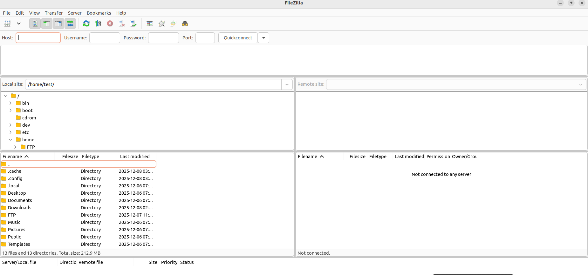
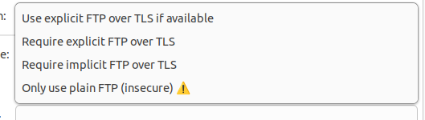
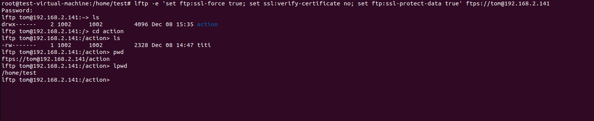
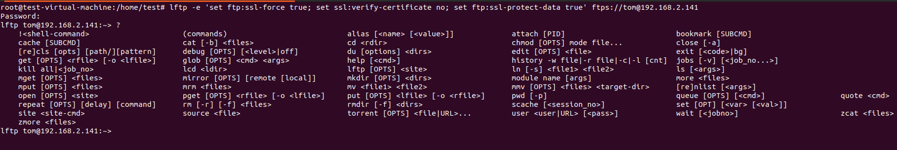

# FTP
File transfer protocol (FTP) is a way to transfer document in a client server model. The client connect to the server and is allowed to check files on the server, put file in the server or retrieve files in the server. FTP uses port 21. FTP isn't secure because it isn't encrypted but FTPS in encrypted.

## How to install vsftpd 
vsftpd is a lightweight ftp server on linux. It allows us to configure FTP and FTPS. I will first show how to install and configure the regular ftp then i will show how to force FTPS.

```
sudo apt install vsftpd
```
Now we will go in the configuraiton files and make sure all the following lines appear in /etc/vsftpd.conf
```
sudo vim /etc/conf
anonymous_enable=NO
listen=Yes
write_enable=Yes
xferlog_enable=YES
xferlog_file=/var/log/vsftpd.log
xferlog_std_format=YES
use_localtime=YES
log_ftp_protocol=YES
```
If you enable listen=yes do not enable listen_ipve=yes it will cause problems.<br><br>
These command will do the following. It not allow anonymous user to connect to the server, it will allow ftp user to do regular operation like addind retrieving and deleting files, it enables ftp log in the file /var/log/vsftpd.log, and it will make the log more detailed. I also recommend to use the following command. <br><br>`chroot_local_user=YES` will restrict user to their home directory so they wont be able to look at other user directory or modify them.<br>`local_root=/home/FTP/$USER` This will force the user to connect to /home/user/upload dirctory instead of /home/user.
<br>`ftpd_banner=` Will show a banner message anytime somone tries to use the ftp service.<br>`user_sub_token=$USER` allow the string $USER to be replace by the ftp user username that is currently logged in.

### Passive mode
There are 2 channel ftp has. The <b>control channel </b> is used for sending command and response from the client and server. So login, ls, cd,  are all in this channel. The channel uses port 21 by default.<br>The <b> data channel </b> ise used to transfer data between client and server. In the active mode The server opens port 20 to transfer data with the client

There are also 2 channel type in ftp active and passive.<br><br><b>Active mode:</b> The client opens control channel with server. then server initiate data channel.This might cause problem with client inbound firewall rules  block incoming connection.<br><b>Passive mode:</b> The client still initiate control channel but client also initiate data channel. This avoids inbound firewall issues because all connections originate from the client, following outbound firewall rules.

so i also recommend you add these option in te vsftpd.conf file.<br>
`pasv_enable=YES` this will enable passive mode support but not force it.<br>
`pasv_min_port=<number>` This command will determine the lowest port the ftp server can use for its data connection.<br>
`pasv_max_port=<number>` This command will determine the higest port the ftp server can use for its data channel.<br>
`pasv_address=<IP Adresse>` This command will tell the client what ip to connect to use when using passive mode. this is usefull when the ftp server is behind nat.<br><br> Example, let say my router forward its port 11112 to my ftp server port 21 for control channel and passive mode uses port 30000 to 50000. In this set the client will connect to the public ip port 11112 for ftp commands and for each file transfer between client and server client will connect to public IP 30000 to 50000 which the router forward to the same ports on the ftp server.

The following would be a complete basic vsftpd.conf file
```
anonymous_enable=NO
listen=Yes
listen_ipv6=no
write_enable=Yes
xferlog_enable=YES
xferlog_file=/var/log/vsftpd.log
xferlog_std_format=YES
use_localtime=YES
log_ftp_protocol=YES
chroot_local_user=YES
local_root=/home/$USER/FTP
ftpd_banner=This is IT FTP server
user_sub_token=$USER
pasv_enable=YES
pasv_min_port=30000
pasv_max_port=35000
pasv_address=13.14.15.16
secure_chroot_dir=/var/run/vsftpd/empty
connect_from_port_20=YES
local_enable=YES
```
I think i might of forgot to explain 2 of the following commands but there are comments in the vstpd.conf that explain most options

after saving your modification restard the vsftpd service with `sudo systemctl restart vsftpd`. You can use the `sudo systemctl status vsftpd` to see if your service is working

## User and folder creation
I will do a script after to check every user on the system and crate a ftp folder of it isn't already made but now i will show it how to do it manually.

```
sudo useradd test
passwd test


mkdir -p /home/FTP
chown root:root /home/FTP
chmod 755 /home/user/FTP

mkdir -p /home/FTP/test
chown root:test /home/FTP/test
chmod 750 /home/FTP/test

mkdir -p /home/FTP/test/action
chown test:test /home/FTP/test/action
chmod 700 /home/FTP/test/action
```
If i gave test writing permission to /home/FTP/test i would get the error message `500 OOPS: vsftpd: refusing to run with writable root inside chroot()`. This is because the chroot directory (the root of the FTP session) must not be writable by the user for security reasons, and this restriction is enforced by the chroot_local_user=YES option in vsftpd.<br>
I could just add `allow_writeable_chroot=YES` to vsftpd.conf but this is less secure

## Basic ftp command linux
To connect to ftp server use the command `ftp IP-addresse`. You can also add `-p port_number` after the ip addresse to specify which port to go to.

to check all ftp command in ftp use ? or help while your in the ftp server but here is a list of basic linux ftp commands

| Command | Description |
|---------|-------------|
| help / ? | Show all FTP commands |
| cd      | Change remote directory |
| lcd     | Change local directory |
| ls      | List remote files |
| mkdir   | Create remote directory |
| pwd     | Show remote directory |
| delete  | Delete remote file |
| rmdir   | Remove remote directory |
| get     | Download a file |
| mget    | Download multiple files |
| put     | Upload a file |
| mput    | Upload multiple files |

## FTPS 
To start let create a ssl certificate for oure server use the following command
```
openssl req -x509 -nodes -days 365 -newkey rsa:2048 -keyout vsftpd.key -out vsftpd.crt
```
This will force you to enter information about your certificate you can use option whil entering the previouse command to skip this part

move both files to /etc/ssl/private/
```
mv vsftpd.key /etc/ssl/private
mv vsftpd.crt /etc/ssl/private
```
Now add the following lines in your vsftpd.conf file

```
rsa_cert_file=/etc/ssl/private/vsftpd.crt
rsa_private_key_file=/etc/ssl/private/vsftpd.key
ssl_enable=YES
force_local_logins_ssl=YES
force_local_data_ssl=YES
ssl_tlsv1=YES
ssl_sslv2=NO
ssl_sslv3=NO
require_ssl_reuse=NO
ssl_ciphers=HIGH
allow_anon_ssl=NO
implicit_ssl=YES
listen_port=990
```

to enable ftp and ftps at the same time remove implict ssl=yes and list_port 990. also change both force ssl to =NO

## filezillas
The easiest way to use ftps if with filezilla. You can download it by it official site or with wget but with ubuntu there is quicker way. enter the follwing command to install filezilla and the last one to start the app.
```
sudo apt install filezilla -y
filezilla
```
You should see something like this 


Go to File site manager and click new site and you should see something like this 


Here you enter your information Host IP select implicit FTP over TLS and your user credential than you click on collect.<br><b>Remark</b> If you didn't add implicit_ssl in yor server configuraiton file you will have to enter the port of the server 990 and select Require or explicit FTP over TLS if available.



After all of that you will be able to see your local folder on the left and ftp server folder on the right


## lftp
FTP command doent work well when ftps is configured so we have to use another tool. There are probably better tools that exist but i will show you how to use lftp. First of all you need to install lftp on your system. After use the following command to connect to the server 
```
lftp ftps://<IP ADDRESS>:<port>
lftp <IP ADDRESS>:~> set ftp:ssl-force true
lftp <IP ADDRESS>:~> set ssl:verify-certificate no
lftp <IP ADDRESS>:~> set ftp:ssl-protect-data true
lftp <IP ADDRESS>:~> login username
password:
lftp <IP ADDRESS:~> ls 
```
You can also do the following command to do everything in one large command

```
lftp -e 'set ftp:ssl-force true; set ssl:verify-certificate no; set ftp:ssl-protect-data true' ftps://<username>@192.168.2.141
or
lftp -e 'set ftp:ssl-force true; set ssl:verify-certificate no; set ftp:ssl-protect-data true' ftps://192.168.2.141
```

If you didnt configure implicit ssl you will have to enter: `<port>` after the ip address.

This is what it will look like



lastly most lftp commands are very similar to ftp command. If you don't know a command just enter ? to check what it does

